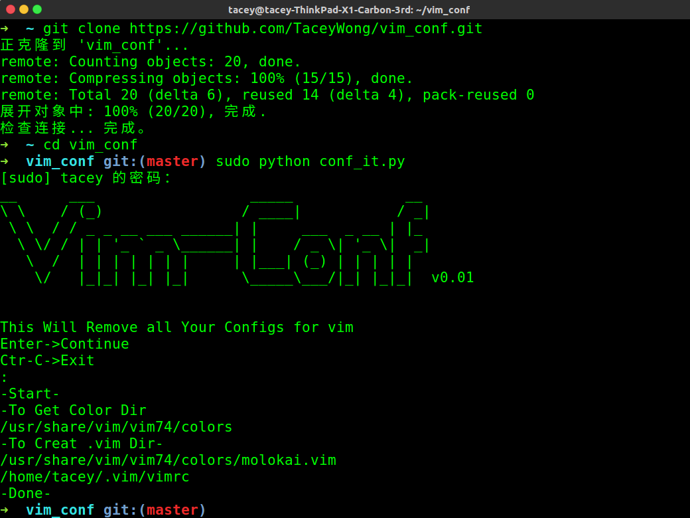

# vim-conf
自己使用的vim配置脚本

主要设置项：

+ 行号
+ 语言匹配
+ molokai真彩主题

**注意**:该脚本会删除你之前所有关于vim的配置

使用:

```bash
$ git clone https://github.com/TaceyWong/vim_conf.git
$ cd vim_conf
$ sudo python conf_it #一定要加sudo
```
正常使用的具体场景应该像下面一样：

